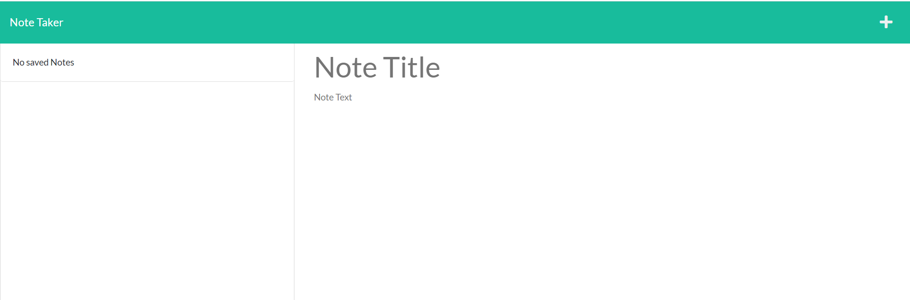
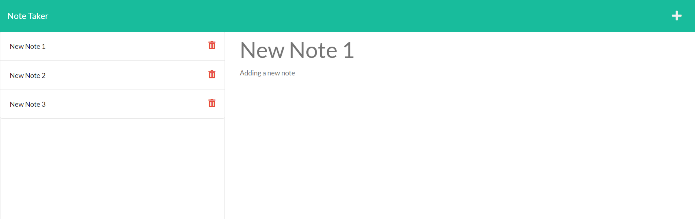

# Noted

## Description

Noted is an online application that allows users to jot down and save notes to remind themselves of tasks to be completed or other important things.

## Table of contents

- [Installation](#Installation)
- [Usage](#Usage)
- [License](#License)
- [Contributing](#Contributing)
- [Tests](#Tests)
- [Questions](#Questions)

## Installation

There is no installation required. The user just needs to visit the link at which Noted is hosted: <https://noted-again.herokuapp.com/>

## Usage

Upon navigating their browser to the Noted application link, the user will be greeted with the “Note Taker” title page. Click the “Get Started” button to be taken to the notes page. On the notes page the user can review their existing notes as well as add new notes. To add a new note, click the + (plus) icon at the top right corner. Once the “Note Title” and “Note Text” fields have been populated a save icon (floppy disk) will appear next to the + sign. Click on the save icon to store the note for the future and the new note will be added to the list of notes on the left.

## License

Copyright 2022 jasonarritt

      Permission is hereby granted, free of charge, to any person obtaining a copy of this software and associated documentation files (the "Software"), to deal in the Software without restriction, including without limitation the rights to use, copy, modify, merge, publish, distribute, sublicense, and/or sell copies of the Software, and to permit persons to whom the Software is furnished to do so, subject to the following conditions:

      The above copyright notice and this permission notice shall be included in all copies or substantial portions of the Software.

      THE SOFTWARE IS PROVIDED "AS IS", WITHOUT WARRANTY OF ANY KIND, EXPRESS OR IMPLIED, INCLUDING BUT NOT LIMITED TO THE WARRANTIES OF MERCHANTABILITY, FITNESS FOR A PARTICULAR PURPOSE AND NONINFRINGEMENT. IN NO EVENT SHALL THE AUTHORS OR COPYRIGHT HOLDERS BE LIABLE FOR ANY CLAIM, DAMAGES OR OTHER LIABILITY, WHETHER IN AN ACTION OF CONTRACT, TORT OR OTHERWISE, ARISING FROM, OUT OF OR IN CONNECTION WITH THE SOFTWARE OR THE USE OR OTHER DEALINGS IN THE SOFTWARE.

<https://opensource.org/licenses/MIT/>

## Contributing

Those who would like to contribute can reach out to the email address provided in the Questions section below.

## Tests

No tests have been written for the Noted application.

## Questions

GitHub is located at <https://github.com/jasonarritt/>.

If you have questions please, please contact jason.a.arritt@gmail.com.

This README.md was generated using README.md Doctor.
Copyright 2022.
